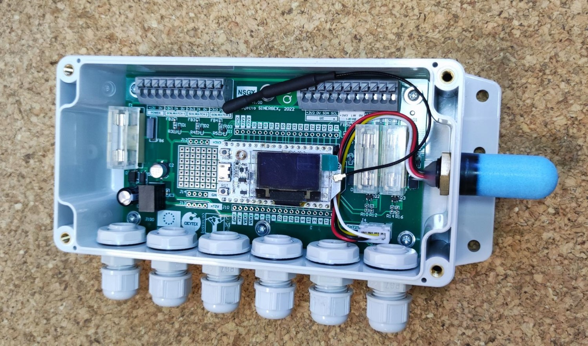

# nsgx
Nodo LoRaWAN para monitorizar el estado de plantas de alcornoque en el proyecto SINERGEX

**1. Características principales.**
- Microcontrolador Heltec ESP32 LoRa V2.
- Alimentación a 12VDC con regulador conmutado de alta eficiencia,
protección de polaridad inversa y fusible.
- Conectividad WIFI/Bluetooth/LoRa
- 3 canales de entrada para sensores de humedad SOILWATCH.
- 1 canal de entrada para sensor de temperatura DS18B20.
- Medida local de temperatura y humedad (sensor SHT21)
- 2 salidas de transistor para electroválvulas de 12VDC con detección de
rotura de fusible.
- Zona de prototipado.
- Protección inversión de polaridad alim
- Conexiones mediante bornas tipo “cepo”.
- Acceso mediante pasamuros PG7.
- Caja policarbonato IP65.

**2. Descripción y conexionado**
  

  
La equivalencia entre las E/S de NSGX y el procesador Heltec ESP32 LoRa
V2 son las siguientes:
|      E/S NSGX      |Heltec ESP32 LoRa v2.1|    DIR   |
|--------------------|---------------------|----------|
| SENSOR SOILWATCH 1 |          36         |  ANALOG  |
| SENSOR SOILWATCH 2 |          38         |  ANALOG  |
| SENSOR SOILWATCH 3 |          39         |  ANALOG  |
|     EV1 OUTPUT     |           2         |  OUTPUT  |
|     EV2 OUTPUT     |          23         |  OUTPUT  |
|    EV1 FUSE OPEN   |          32         |  INPUT   |
|    EV2 FUSE OPEN   |          33         |  INPUT   |
|   DS18B20 BUS 1W   |          13         |   I/O    |
|         LED        |          25         |  OUTPUT  |

**3. Especificaciones técnicas generales.** 
- Alimentación: 12VDC +/-10%
- Consumo máximo: 0.5W
- Microcontrolador: ESP32
- Corriente máxima salida EVs: 500mA
- Temperatura de funcionamiento: 0 ~ 50 ºC
- Temperatura de almacenamiento: -20 ~ 85 ºC
- Grado de protección IP: IP65
- Ancho: 190 mm
- Alto: 100 mm
- Fondo 55 mm
- Peso: 300 g.  
**4. Especificaciones sensor temperatura y humedad local**
- Tipo sensor: SHT21 (SENSIRION)
- Interface: I2C
- Resolución temperatura: 0.1ºC
- Rango de medida: -40 ~ 85ºC
- Precisión típica: +/- 0.3ºC
- Precisión máxima: +/- 1ºC
- Resolución humedad: 1%
- Rango de medida: 0 ~ 100%RH
- Precisión típica: +/- 2%RH
- Precisión máxima: +/- 5%RH
